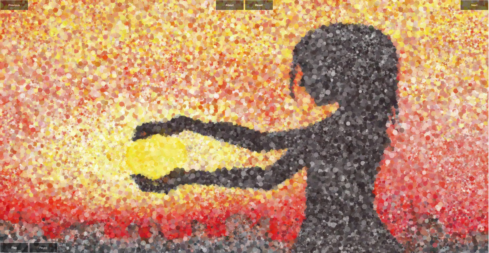

# Simple Geometry

Simple Geometry is an example of implementing the concept of **sampling** using [Bridson's Algorithm](http://www-devel.cs.ubc.ca/~rbridson/docs/bridson-siggraph07-poissondisk.pdf) to create a Poisson-Disc.

## Overview

Simple Geometry is built with Vanilla JavaScript for the sampling and button interactions and HTML5's Canvas for rendering the painting.

The game begins with a cleared board, and as soon as the user clicks on the screen, the screen starts getting filled with circles, creating a pointillism effect. These circles begin from a random spot on the canvas, and continue to spread out almost-evenly until a picture is made. The circles will slowly have a smaller radius as time goes by, creating a clearer and clearer picture. The user may click the next or previous buttons at the top to move through different images.

## Design

The `BridsonsAlgorithm` class holds all the logic for creating the algorithm, such as choosing active samples, deciding which locations to place new samples for even distribution, and deciding when a sample should go from being active to dead. The `ImageStuff` class contains the logic for creating the image and pulling the color data for each pixel. The algorithm and image sampling come together in the `main` file along with the functionality of the buttons and audio.
